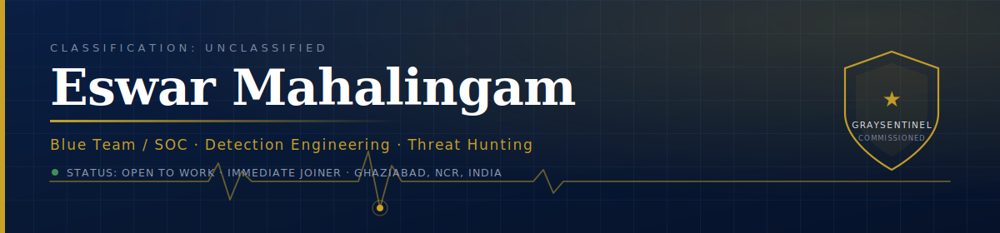

<div align="center">

[](https://eswarhero.netlify.app)
[](https://www.linkedin.com/in/eswar-mahalingam)
[](mailto:YOUR-EMAIL@example.com)

</div>

---

### `whoami`

I spent **8+ years** in operations, supply chain and analytics learning how to run an escalation, hit an SLA, and find the root cause of a failure under pressure.

Now I do the same thing to adversaries.

I'm a **Blue Team / SOC practitioner** — I engineer detections, hunt multi-stage attacks, and turn noisy telemetry into a clear incident story. My conviction, learned the hard way: **detection quality is decided before the incident, not during it.** The Sysmon config written on a quiet Tuesday is what saves you on a loud one.

Everything I build is public — including the rules that didn't work, and why.

```yaml
role:      Blue Team / SOC · Detection & Response
current:   Data Analyst @ HEXA Solutions  |  Cyber Security Trainee @ GraySentinel
focus:     Detection engineering · Threat hunting · Incident response
location:  Ghaziabad, NCR, India
open_to:   SOC Analyst · Security Analyst · Detection Engineer
mobility:  PAN-India · EU (Blue Card track) · Gulf  |  Immediate joiner
languages: English · Hindi · Tamil · Telugu · Deutsch (A1, lernend)
```

---

### 🛡️ Arsenal

**Defensive**
<br>


**Offensive (to know the adversary)**
<br>


**Code & Data**
<br>


---

### 🎯 Featured Work

| Project | What it is |
|---|---|
| **[GraySentinel Commissioning Portfolio](https://github.com/Eswar5313/GraySentinel-Commissioning-Portfolio)** | 45 days, 177+ operational tasks. Custom Suricata + Sigma rules, SOC playbooks, log-analysis automation, and a live Red-vs-Blue campaign where I contained an intrusion before exfiltration. Reports included — gaps and all. |
| **[Portfolio Site](https://eswarhero.netlify.app)** | Career control tower — verified metrics, full work history. |

---

### 📊 What 8 years of operations actually taught me

These are from my pre-security career. They're here because they're the reason I'm good at this:

| Metric | Why it matters in a SOC |
|---|---|
| **₹13.5 Cr+** sales delivered · **32%** conversion | I can write for executives who don't want jargon |
| **30%** stockout reduction · **22%** cycle-delay cut | Root-cause analysis is root-cause analysis (Six Sigma Black Belt) |
| **92%+** CSAT · **87%** first-contact resolution | Escalation handling and staying calm when something's on fire |

Most junior SOC candidates have none of this. It isn't adjacent to the work — it *is* the work.

---

### 🎓 Credentials

**MBA** Operations & Marketing, SRM IST · **B.Com** University of Madras · **PG Diploma** Logistics & SCM
<br>
Six Sigma Black Belt · CSCMP SCPro · Google Data Analytics / BI / PM · Salesforce Administrator · IIM-A Supply Chain Digitization · GraySentinel Commissioning Program

---

<div align="center">

> *"I will stay curious. I will stay hungry. I will stay ethical."*

**Open to SOC / Blue Team roles — India & international. Immediate joiner.**

</div>
